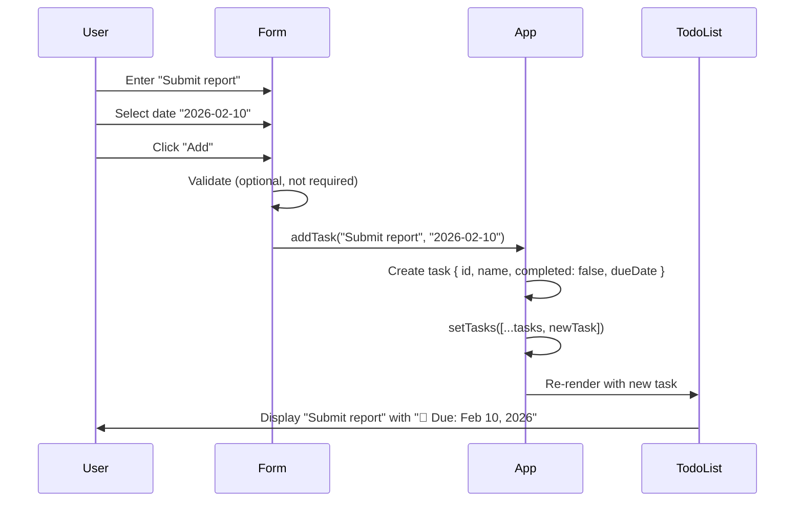
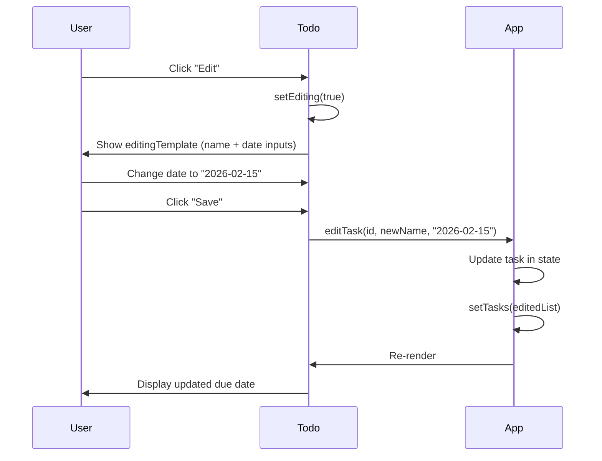
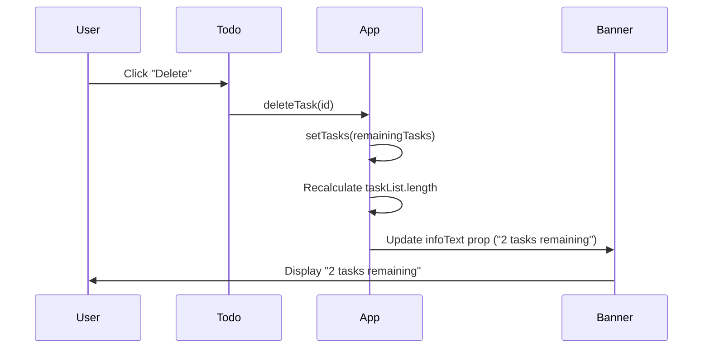

# Architecture Design: PRD-001, PRD-002, PRD-003

## 1. Feature Summary

**What**: Enhance TodoMatic with improved button styling (PRD-001), a top banner with app info (PRD-002), and due date support for tasks (PRD-003).

**Who**: End users interacting with the todo demo; developers showcasing React + Vite capabilities.

**Why**: Create a more polished, demo-ready UI with better visual hierarchy and richer task data. The banner provides context, improved button styles guide user actions, and due dates add practical task management functionality.

**Scope**: This is a frontend-only enhancement with no external dependencies. Data persists in React state only (no localStorage at this phase).

---

## 2. UI/UX Behavior

### PRD-001: Improved Button Styling

**What the user sees**:
- Primary action buttons ("Add", "Save") have a distinct color (e.g., green or blue background).
- Destructive buttons ("Delete") remain red with white text.
- Filter buttons show a clear selected state (darker background or border when `aria-pressed="true"`).
- All buttons display hover states (slight color shift or scale).

**States**:
- Normal: default button appearance
- Hover: visual feedback (color change, slight brightness increase)
- Active/Pressed: filter buttons show selected state
- Disabled: not required for this feature set

### PRD-002: Top Banner

**What the user sees**:
- A horizontal banner at the top of the app, above the "TodoMatic" heading.
- Banner contains:
  - **Title**: "TodoMatic"
  - **Subtitle**: "React + Vite demo" (or similar descriptive text)
  - **Info item**: One of the following (recommend: task count matching existing logic)
    - Current task count (e.g., "3 tasks remaining")
    - Current filter name (e.g., "Showing: All")
    - Today's date (e.g., "Feb 6, 2026")

**Layout**:
- Banner spans full width of `.todoapp` container.
- Title/subtitle aligned left; info item aligned right (flexbox).
- Minimal padding, neutral background color (e.g., light gray or soft blue).

**States**:
- Static display, no interaction. Info updates reactively based on task list changes.

### PRD-003: Due Date Field

**What the user sees**:

**Adding a task**:
- Below the task name input, a new optional date input field labeled "Due date (optional)".
- User can leave it blank or select a date via native date picker (`<input type="date">`).

**Viewing a task**:
- If a due date is set, display below the task name: `📅 Due: Feb 4, 2026` (formatted).
- If no due date, show nothing extra.

**Editing a task**:
- Edit form includes a date input pre-populated with the current due date (or empty).
- User can update or clear the due date.

**Empty states**:
- If no due date is set, the task item renders normally without showing placeholder text or "No due date".

**Error states**:
- No validation required at this phase (dates in the past are acceptable).

---

## 3. Data Model

### Current Task Shape
```javascript
{
  id: "todo-0",
  name: "Eat",
  completed: false
}
```

### New Task Shape (PRD-003)
```javascript
{
  id: "todo-0",
  name: "Eat",
  completed: false,
  dueDate: "2026-02-04"  // ISO 8601 date string (YYYY-MM-DD) or null/undefined
}
```

**Examples**:
```javascript
// Task with due date
{
  id: "todo-1",
  name: "Submit report",
  completed: false,
  dueDate: "2026-02-10"
}

// Task without due date (backward-compatible)
{
  id: "todo-2",
  name: "Call dentist",
  completed: false,
  dueDate: null  // or undefined, or omitted entirely
}
```

**Storage**: In-memory React state only (no persistence). The `DATA` array in `main.jsx` can optionally include `dueDate` for demo purposes.

---

## 4. Component Impact Map

| File | Change Type | Description |
|------|-------------|-------------|
| `src/index.css` | **Minor Edit** | Add/update button styles (`:hover`, `.btn__primary`, `.btn__danger`, `.toggle-btn[aria-pressed]`). Add banner styles (`.app-banner`, `.banner-info`). Add due date display styles (`.task-due-date`). |
| `src/App.jsx` | **Moderate Edit** | Import new `<Banner>` component. Pass banner props (taskList length, filter name). Update `addTask()` to accept `dueDate` param. Update `editTask()` to accept `dueDate` param. Pass `dueDate` prop to `<Todo>`. |
| `src/components/Form.jsx` | **Moderate Edit** | Add state for `dueDate` input. Add `<input type="date">` field. Pass `dueDate` to `addTask()` on submit. Clear date field after submit. |
| `src/components/Todo.jsx` | **Moderate Edit** | Accept `dueDate` prop. Display due date in `viewTemplate` (if present). Add date input to `editingTemplate`. Pass `dueDate` to `editTask()` on save. |
| `src/components/FilterButton.jsx` | **No Change** | Already supports `aria-pressed`. CSS updates handle selected state. |
| `src/components/Banner.jsx` | **New Component** | Stateless functional component. Receives props: `title`, `subtitle`, `infoText`. Renders top banner with flexbox layout. |
| `src/main.jsx` | **Minimal Edit** | Optionally add `dueDate` to sample `DATA` entries (for demo). |

---

## 5. State & Data Flow

### Current State (in App.jsx)
- `tasks`: array of task objects
- `filter`: string ("All" | "Active" | "Completed")

### New State Flow (PRD-003)

**Adding a task with due date**:
```
User enters name + date in Form
  ↓
Form.handleSubmit() calls props.addTask(name, dueDate)
  ↓
App.addTask(name, dueDate) creates new task {..., dueDate}
  ↓
setTasks([...tasks, newTask])
  ↓
React re-renders → Todo components receive dueDate prop
```

**Editing a task's due date**:
```
User clicks Edit in Todo
  ↓
Todo switches to editingTemplate (shows date input)
  ↓
User changes date and clicks Save
  ↓
Todo.handleSubmit() calls props.editTask(id, newName, newDueDate)
  ↓
App.editTask(id, newName, newDueDate) updates task {..., name, dueDate}
  ↓
setTasks(editedTaskList)
  ↓
React re-renders → Todo displays updated due date
```

**Banner info update** (PRD-002):
```
User adds/deletes/completes a task
  ↓
App.setTasks() triggered
  ↓
React re-renders → Banner receives updated infoText prop (e.g., "3 tasks remaining")
```

**State location**: All state remains in `App.jsx` (no new state management needed). Form and Todo remain controlled components.

---

## 6. Component Architecture

```mermaid
graph TD
    A[App.jsx<br/>State: tasks, filter] --> B[Banner.jsx<br/>Props: title, subtitle, infoText]
    A --> C[Form.jsx<br/>Local: name, dueDate]
    A --> D[FilterButton.jsx x3<br/>Props: name, isPressed]
    A --> E[Todo.jsx x N<br/>Props: id, name, completed, dueDate<br/>Local: isEditing, newName, newDueDate]
    
    C -->|addTask(name, dueDate)| A
    E -->|editTask(id, name, dueDate)| A
    E -->|deleteTask(id)| A
    E -->|toggleTaskCompleted(id)| A
    D -->|setFilter(name)| A
    
    style B fill:#e1f5ff
    style C fill:#fff4e1
    style E fill:#fff4e1
```

**Legend**:
- Blue: New component (Banner)
- Yellow: Components with moderate changes (Form, Todo)
- White: Minimal/no change (App, FilterButton)

---

## 7. Key Workflows

### Workflow 1: Add Task with Due Date



### Workflow 2: Edit Task Due Date



### Workflow 3: Banner Info Update



---

## 8. Non-Functional Requirements (NFR)

### Accessibility
- **PRD-001**: Buttons must maintain 4.5:1 contrast ratio for text. Hover states should not rely solely on color (add subtle border or shadow).
- **PRD-002**: Banner should use semantic HTML (`<header>` or `<div role="banner">`). Screen readers should announce info text updates (use `aria-live="polite"` for dynamic count).
- **PRD-003**: Date inputs must have visible labels. Use `<label htmlFor>` pattern. Native date picker is keyboard-accessible by default.

### Performance
- **All PRDs**: No performance concerns. Component re-renders are already optimized via React's default reconciliation. Adding `dueDate` to task object is negligible overhead.
- **PRD-002**: Banner is static and doesn't introduce additional event listeners.

### Security/Privacy
- **PRD-003**: Due dates are user-generated but constrained to valid date format by `<input type="date">`. No XSS risk (React escapes by default). No sensitive data (dates are public-facing in this demo).
- **All PRDs**: No new external dependencies. No API calls. Data stays in client memory.

### Maintainability
- **PRD-003**: Task shape change is backward-compatible (existing tasks without `dueDate` render normally). New components (`Banner.jsx`) follow existing patterns (functional components, props-only).
- **PRD-001**: CSS changes isolated to `index.css`. Use existing class naming conventions (`.btn__*`).
- **Testing**: Manual testing sufficient for demo. If automated tests are added later, focus on: task creation with/without due date, due date editing, banner info updates.

---

## 9. Implementation Steps

### Phase 1: Core Functionality (MVP for Demo)

1. **Create Banner component** (PRD-002)
   - Create `src/components/Banner.jsx` with props: `title`, `subtitle`, `infoText`.
   - Add basic layout (flexbox: title/subtitle left, info right).
   - Import and render in `App.jsx` above `<h1>`.

2. **Update CSS for buttons** (PRD-001)
   - In `src/index.css`, add `:hover` styles for `.btn`.
   - Update `.btn__primary` background color (e.g., `#0070f3` or `#28a745`).
   - Ensure `.btn__danger` has strong red (`#d9534f` or similar).
   - Add `.toggle-btn[aria-pressed="true"]` selected state (darker background + border).

3. **Add due date to data model** (PRD-003)
   - In `src/main.jsx`, add `dueDate: "2026-02-08"` to one sample task (optional, for demo).

4. **Extend Form component** (PRD-003)
   - Add `dueDate` state in `Form.jsx` (default: `""`).
   - Add `<input type="date">` below name input with label "Due date (optional)".
   - Update `handleSubmit` to call `props.addTask(name, dueDate || null)`.
   - Clear `dueDate` field after submit.

5. **Update App.addTask()** (PRD-003)
   - Change signature: `addTask(name, dueDate)`.
   - Include `dueDate` in `newTask` object: `{ id, name, completed: false, dueDate }`.

6. **Display due date in Todo** (PRD-003)
   - In `Todo.jsx`, add conditional render in `viewTemplate`: 
     ```jsx
     {props.dueDate && <p className="task-due-date">📅 Due: {formatDate(props.dueDate)}</p>}
     ```
   - Create helper function `formatDate(isoDate)` to format "YYYY-MM-DD" → "Feb 4, 2026" (use `Date.toLocaleDateString()` or keep ISO format for simplicity).

7. **Support due date editing in Todo** (PRD-003)
   - Add `newDueDate` state in `Todo.jsx` (default: `props.dueDate || ""`).
   - Add `<input type="date">` in `editingTemplate` with `value={newDueDate}` and `onChange`.
   - Update `handleSubmit` to call `props.editTask(props.id, newName, newDueDate || null)`.

8. **Update App.editTask()** (PRD-003)
   - Change signature: `editTask(id, newName, newDueDate)`.
   - Update task object: `{ ...task, name: newName, dueDate: newDueDate }`.

9. **Wire Banner info** (PRD-002)
   - In `App.jsx`, pass props to `<Banner>`:
     ```jsx
     <Banner 
       title="TodoMatic" 
       subtitle="React + Vite demo" 
       infoText={headingText}  // Reuse existing "X tasks remaining"
     />
     ```
   - (Alternative: pass `infoText={filter}` to show current filter, or `infoText={new Date().toLocaleDateString()}` for date.)

10. **Add Banner CSS** (PRD-002)
    - In `src/index.css`, add:
      ```css
      .app-banner {
        display: flex;
        justify-content: space-between;
        align-items: center;
        padding: 1rem;
        background-color: #f0f0f0;
        border-bottom: 1px solid #ddd;
      }
      .banner-title { font-size: 1.5rem; font-weight: bold; }
      .banner-subtitle { font-size: 0.9rem; color: #666; }
      .banner-info { font-size: 0.9rem; color: #333; }
      ```

11. **Add due date display CSS** (PRD-003)
    - In `src/index.css`, add:
      ```css
      .task-due-date {
        font-size: 0.85rem;
        color: #555;
        margin-top: 0.25rem;
      }
      ```

12. **Manual testing**
    - Run `yarn dev` and verify:
      - Banner displays at top with task count.
      - Add button has primary color, Delete button is red.
      - Filter buttons show selected state.
      - All buttons have hover effects.
      - Can add task with due date.
      - Due date displays in task item.
      - Can edit task's due date.
      - Tasks without due date render normally.

13. **Lint and build**
    - Run `yarn lint` and fix any issues.
    - Run `yarn build` to verify production bundle.
    - Run `yarn preview` for final smoke test.

### Phase 2: Polish (Optional Enhancements)

- **PRD-002 Enhancement**: Add icon to banner (e.g., ✅ emoji or SVG icon).
- **PRD-003 Enhancement**: Highlight overdue tasks (compare `dueDate` to today's date, apply red text or background).
- **PRD-001 Enhancement**: Add focus-visible styles for keyboard navigation.
- **PRD-003 Enhancement**: Sort tasks by due date (soonest first).
- **PRD-003 Enhancement**: Add "Clear due date" button in edit form.

---

## 10. Phased Rollout Recommendation

**Recommended approach**: Implement all three PRDs in Phase 1 (steps 1–13 above) as a single cohesive update. Total effort: ~2–4 hours for an experienced React developer.

**Rationale**:
- PRD-001 (CSS) and PRD-002 (Banner) are low-risk, non-invasive changes.
- PRD-003 (due dates) is the most substantial change but follows existing patterns (controlled inputs, state updates).
- Bundling all three delivers a polished demo experience in one iteration.

**Alternative (if time-constrained)**:
- **Mini-Phase 1**: PRD-001 + PRD-002 (1 hour) — quick visual polish.
- **Mini-Phase 2**: PRD-003 (2–3 hours) — due date feature.

---

## 11. Risk Assessment

| Risk | Likelihood | Impact | Mitigation |
|------|------------|--------|------------|
| Date input not supported in older browsers | Low | Medium | Use native `<input type="date">` (supported in all modern browsers). Fallback: text input with placeholder "YYYY-MM-DD". |
| Due date breaks existing functionality | Low | High | Ensure `dueDate` is optional. Test tasks without due dates render unchanged. |
| Button color contrast fails WCAG | Low | Medium | Use color contrast checker during CSS updates. Test with dev tools. |
| Banner clutters small screens | Medium | Low | Use responsive CSS (`@media` queries) to stack banner items vertically on mobile. |
| State updates cause unnecessary re-renders | Low | Low | React's reconciliation handles this efficiently. If performance issues arise, use `React.memo()` on Todo. |

---

## 12. Success Criteria

**PRD-001**:
- ✅ "Add" and "Save" buttons have consistent primary color (e.g., green/blue).
- ✅ "Delete" button has red background.
- ✅ Filter buttons show selected state (darker background when pressed).
- ✅ All buttons have visible hover state.

**PRD-002**:
- ✅ Banner visible at top of app.
- ✅ Banner shows title ("TodoMatic") and subtitle ("React + Vite demo").
- ✅ Banner shows one info item (task count, filter name, or date).
- ✅ Banner info updates reactively when tasks change.

**PRD-003**:
- ✅ Form includes optional due date input.
- ✅ Tasks with due dates display date below task name.
- ✅ Tasks without due dates show no extra content.
- ✅ Edit form includes due date input pre-populated with current value.
- ✅ Can update or clear due date when editing.

**General**:
- ✅ `yarn lint` passes with no errors.
- ✅ `yarn build` succeeds.
- ✅ Manual smoke test in `yarn preview` confirms all workflows.

---

## 13. Developer Handoff Notes

**For the implementation engineer**:
1. Start with PRD-002 (Banner) — easiest, builds confidence.
2. Then PRD-001 (CSS) — low risk, immediate visual feedback.
3. Finally PRD-003 (due dates) — most complex, but well-scoped.
4. Use existing code patterns (functional components, controlled inputs, props drilling).
5. No new dependencies required — all features use native HTML5 + React.
6. Focus on accessibility: labels, keyboard nav, contrast ratios.
7. Keep task shape backward-compatible: `dueDate` is optional, defaults to `null`.
8. Test edge cases: empty due date, editing without changing date, deleting task with due date.

**Questions or blockers?** Refer back to this doc or escalate to the architect (or senior dev) if you encounter issues not covered here.

---

**Document version**: 1.0  
**Created**: Feb 6, 2026  
**Author**: Solution Architect
